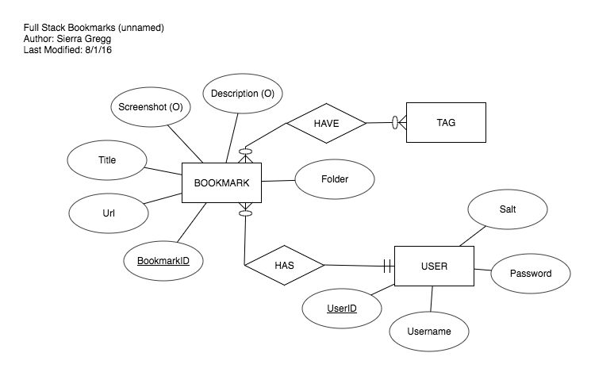
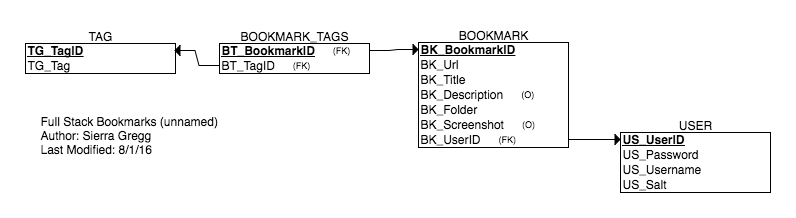

# Backend for the Bookmark Project (better name to come)

## Overview

Full explanation are avaliable via the [front-end README](https://github.com/robbykim/bookmarks-fullstack)

## Installation

## Database
Postgres 9.5.3

